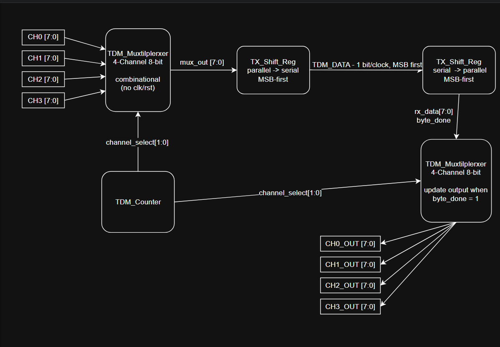

# TDM 4-Channel Multiplexer/Demultiplexer — Verilog RTL Project

---

## 1. Project Description

This project implements a **4-Channel Time Division Multiplexing (TDM) Multiplexer/Demultiplexer** in Verilog HDL/RTL. Four parallel 8-bit input channels (`CH0`–`CH3`) are serialized onto a single wire (`TDM_DATA`) using time-division multiplexing, then deserialized back into four independent 8-bit output channels (`CH0_OUT`–`CH3_OUT`) that must exactly match the original inputs after one complete frame.

### 1.2 Objective

- Understand the concept of Time Division Multiplexing and why it is used to share one physical line among multiple data sources.
- Implement a counter-driven (no FSM) TDM system: a single shared bit counter drives channel selection, byte timing, and frame boundaries for the entire design.
- Implement parallel-to-serial (`tx_shift_reg`) and serial-to-parallel (`rx_shift_reg`) shift registers, MSB-first.
- Verify functional correctness with a self-checking testbench and a Python golden model, then obtain resource utilization and timing reports via Xilinx Vivado.

*(Status: `tdm_mux.v` complete and verified; remaining modules in progress — see Section 8.)*

---

## Table of Contents

* [Project Description](#1-project-description)
* [System Overview](#2-system-overview)
* [General Block Diagram](#3-general-block-diagram)
* [Repository Structure](#4-repository-structure)
* [Module Index](#5-module-index)
* [Interface Specifications](#6-interface-specifications)
* [System Workflow](#7-system-workflow)
* [Experimental Results](#8-experimental-results)
* [Known Open Items](#9-known-open-items)
* [Limitations](#10-limitations)
* [Future Work](#11-future-work)

---

## 2. System Overview

The system is a single continuous data path (no branching architectures — unlike some comparison-style FPGA projects, this design has exactly one locked architecture):

- **Input:** Four parallel 8-bit channels `CH0`–`CH3` are always present at the top-level inputs.
- **Timing:** A single 5-bit counter (`tdm_counter`) is the only source of timing in the system. It counts `bit_count` from 0 to 31 continuously; `channel_select = bit_count[4:3]` derives which channel is active.
- **Serialization:** `tdm_mux` selects the active channel's byte; `tx_shift_reg` shifts it out 1 bit per clock, MSB-first, onto `TDM_DATA`.
- **Deserialization:** `rx_shift_reg` samples `TDM_DATA` 1 bit per clock and reconstructs a byte every 8 clocks, pulsing `byte_done` for exactly 1 clock.
- **Output:** `tdm_demux` routes the completed byte into the correct `CHx_OUT` register based on `channel_select`, only when `byte_done = 1`.
- **No FSM anywhere** — all control is derived from the single shared counter, since the system's behavior is fully periodic and predictable.

---

## 3. General Block Diagram





---

## 4. Repository Structure

```
TDM-4Channel-Mux-Demux/
├── src/
│   ├── tdm_counter.v        # TODO
│   ├── tdm_mux.v            # DONE
│   ├── tx_shift_reg.v       # TODO - has open item, see Section 9
│   ├── rx_shift_reg.v       # TODO
│   ├── tdm_demux.v          # TODO
│   └── tdm_top.v            # TODO (integration, after all modules above)
├── constraints/
│   └── constraints.xdc      # TODO - clock constraint added once tdm_top is ready
├── testbench/
│   ├── tb_tdm_mux.v         # DONE - self-checking, 14/14 PASS
│   ├── tb_tdm_counter.v     # TODO
│   ├── tb_tx_shift_reg.v    # TODO
│   ├── tb_rx_shift_reg.v    # TODO
│   ├── tb_tdm_demux.v       # DONE
│   └── tb_tdm_top.v         # TODO - system-level testbench
├── golden_model/            # Python reference model for verification
│   ├── golden_model.py
│   ├── compare_output.py
│   └── verification_logs/
├── results/                 # Vivado utilization/timing reports, per module
│   ├── tdm_mux/
│   └── tdm_top/
├── image/                   # Block diagrams, waveform screenshots
├── docs/                    # Master System Specification (source of truth)
├── LICENSE
└── README.md
```

---

## 5. Module Index

| # | Module | File | Role | Status |
|---|--------|------|------|--------|
| 1 | `tdm_top` | `tdm_top.v` | Top-level integration of all modules above. | TODO |
| 2 | `tdm_counter` | `tdm_counter.v` | Generates `bit_count`/`channel_select`, the only timing source in the system. | TODO |
| 3 | `tdm_mux` | `tdm_mux.v` | Combinational 4-to-1 MUX, selects the active channel's byte. | **DONE** |
| 4 | `tx_shift_reg` | `tx_shift_reg.v` | Parallel-to-serial shift register, MSB-first. | TODO (open item) |
| 5 | `rx_shift_reg` | `rx_shift_reg.v` | Serial-to-parallel shift register, MSB-first, generates `byte_done`. | TODO |
| 6 | `tdm_demux` | `tdm_demux.v` | Routes received byte into the correct `CHx_OUT` register. | **DONE** |


---

## 6. Interface Specifications

### 6.1 `tdm_top` (DONE)

### 6.2 `tdm_counter` (DONE)

### 6.3 `tdm_mux` (DONE)

| # | Port | Type | Width | Description |
|---|------|------|-------|-------------|
| 1 | `CH0`..`CH3` | Input | 8-bit x4 | The 4 parallel input channels |
| 2 | `channel_select` | Input | 2-bit | 00→CH0, 01→CH1, 10→CH2, 11→CH3 |
| 3 | `mux_out` | Output | 8-bit | Selected channel's byte (combinational) |

### 6.4 `tx_shift_reg` (DONE)

| # | Port | Type | Width | Description |
|---|------|------|-------|-------------|
| 1 | `clk`, `rst` | Input | 1-bit | Shared clock, synchronous active-high reset |
| 2 | `mux_out` | Input | 8-bit | Byte to serialize, from `tdm_mux` |
| 3 | `load` | Input | 1-bit | **Not in the original Master Spec Section 14 list** — added to solve the timing gap flagged in the outline (Section 9). Pulses once per byte to capture `mux_out`. |
| 4 | `serial_out` | Output | 1-bit | `tx_shift[7]` — current MSB, continuously assigned |

Priority inside the always block: **RESET > LOAD > SHIFT** (matches the header comment in the file).

### 6.5 `rx_shift_reg` (DONE)

| # | Port | Type | Width | Description |
|---|------|------|-------|-------------|
| 1 | `clk`, `rst` | Input | 1-bit | Shared clock, synchronous active-high reset |
| 2 | `serial_in` | Input | 1-bit | Renamed from the Spec's `serial_data` — **naming deviation, needs team sign-off per Spec Section 27** |
| 3 | `byte_boundary` | Input | 1-bit | **Not in the original Master Spec Section 17 list** — same role as `load` above, seen from the RX side. |
| 4 | `rx_data` | Output | 8-bit | Reconstructed byte, MSB-first |
| 5 | `byte_done` | Output | 1-bit | 1-clock pulse, one cycle after `byte_boundary` was asserted |

### 6.6 `tdm_demux` (DONE)

| # | Port | Type | Width | Description |
|---|------|------|-------|-------------|
 1 | `clk`, `rst` | Input | 1-bit | Shared clock, synchronous active-high reset |
| 2 | `rx_data` | Input | 8-bit | Completed byte from `rx_shift_reg` |
| 3 | `channel_select` | Input | 2-bit | Which `CHx_OUT` to update |
| 4 | `byte_done` | Input | 1-bit | Update gate — only writes when high |
| 5 | `CH0_OUT`..`CH3_OUT` | Output | 8-bit x4 | Reconstructed channels; unselected channels hold their value |


*(Interface tables for the remaining modules will be filled in as each module is completed — see the Master System Specification in `docs/` for the locked interface definitions in the meantime.)*

---

## 7. System Workflow

### 1. Design Stage
Each member implements exactly one assigned module, following the interface/timing/protocol locked in `docs/`'s Master System Specification. Coding style (case vs if/else) may differ between members; interface and behavior must not.

### 2. Verification Stage
Each module gets its own self-checking testbench (see `tb_tdm_mux.v` as the reference pattern) before integration. After all 5 sub-modules pass individually, `tdm_top.v` is assembled and re-verified as a whole system against the integration checklist (Master Spec Section 32), then cross-checked against the Python golden model.

### 3. Synthesis Stage
Once functionally verified, the design is brought into Vivado for synthesis/implementation, using `constraints/constraints.xdc` for clock definition, to obtain the Utilization Report (LUT/FF/BRAM/DSP) and Timing Report.

---

## 8. Experimental Results

*(To be filled in as each module is synthesized. `tdm_mux.v`'s functional simulation result:)*

**`tdm_mux.v` — Icarus Verilog simulation**

| Test group | Cases | Result |
|---|---|---|
| Channel_select mapping sweep (00/01/10/11) | 4 | PASS |
| Combinational tracking (input changes while select fixed) | 3 | PASS |
| Fast select switching | 5 | PASS |
| Boundary values (0x00, 0xFF) | 2 | PASS |
| **Total** | **14** | **14/14 PASS** |

Vivado synthesis utilization report for `tdm_mux.v`: TODO (run Synthesis in Vivado, export to `results/tdm_mux/`).

---

## 9. Known Open Items

- **`tx_shift_reg.v` interface gap:** Master Spec Section 14 lists only `clk, rst, mux_out[7:0] → serial_data` as the interface, but Section 15 requires TX to load a new byte exactly when `bit_count = 0/8/16/24`. No module may create its own frame counter (Section 9/30), so `tx_shift_reg` needs an explicit timing input from `tdm_counter` (either the raw `bit_count[4:0]`, or a derived 1-bit `load` pulse). **Needs team confirmation and a spec update before this module is coded.**
- `rx_shift_reg.v` likely needs a similar internal 3-bit bit-in-byte counter (0–7) to know when to assert `byte_done` — confirm this does not count as a disallowed "frame counter" (Section 9/30) since it only tracks position within one byte, not the frame.

---

## 10. Limitations

- Verified via RTL simulation (Icarus Verilog / ModelSim / Vivado XSIM) only; not yet synthesized/implemented on physical FPGA hardware.
- No FSM by design (locked in spec); any future upgrade path would need explicit team sign-off per Section 28.

---

## 11. Future Work

- Complete `tdm_counter.v`, `tx_shift_reg.v`, `rx_shift_reg.v`, `tdm_demux.v`, `tdm_top.v`.
- System-level self-checking testbench + Python golden model comparison.
- Vivado synthesis/implementation, resource utilization and timing reports for the full system.
- Final report and presentation slides. 
