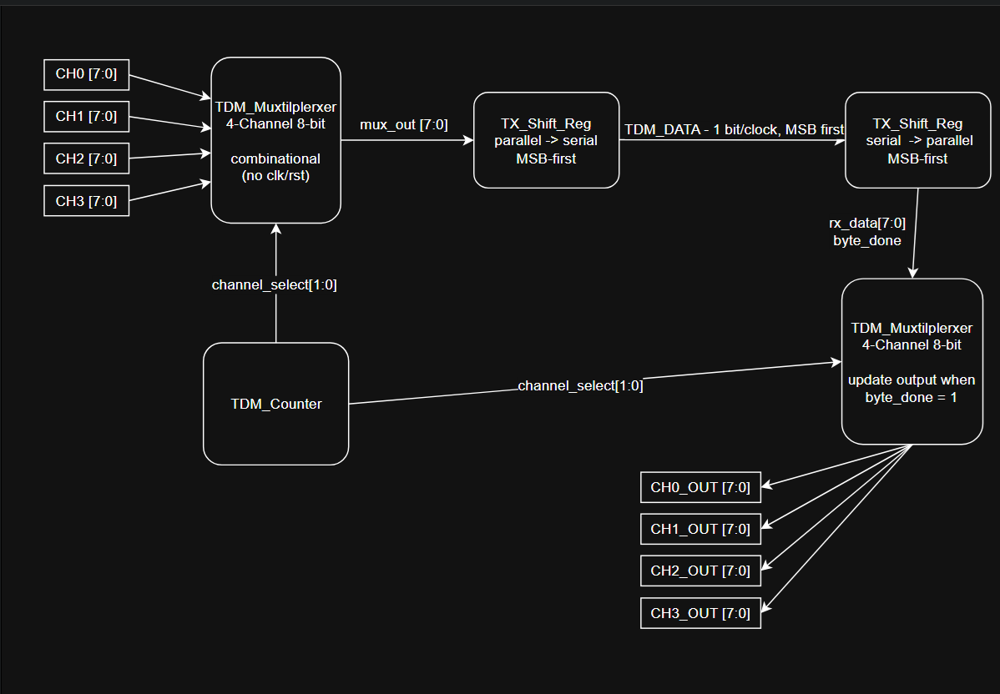
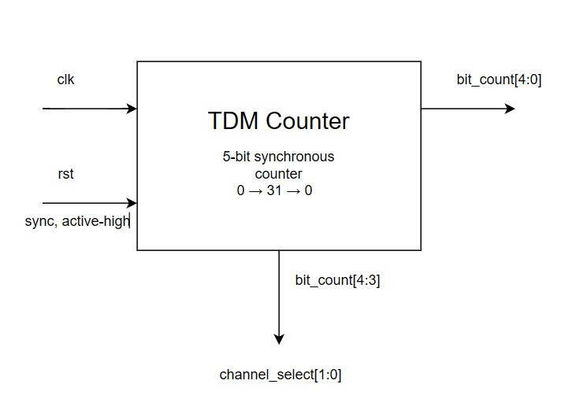
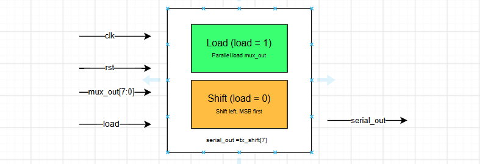
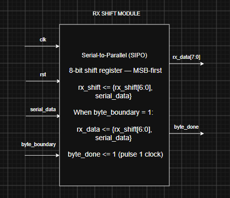
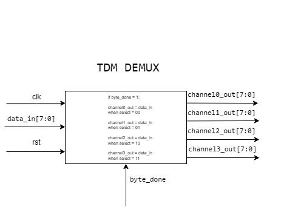

# TDM 4-Channel Multiplexer/Demultiplexer — Verilog RTL Project

---

## 1. Project Description

This project implements a **4-Channel Time Division Multiplexing (TDM) Multiplexer/Demultiplexer** in Verilog HDL/RTL. Four parallel 8-bit input channels (`CH0`–`CH3`) are serialized onto a single wire (`TDM_DATA`) using time-division multiplexing, then deserialized back into four independent 8-bit output channels (`CH0_OUT`–`CH3_OUT`) that exactly match the original inputs after one complete frame of 32 clock cycles.

### 1.1 Objective

- Understand the concept of Time Division Multiplexing and why it is used to share one physical line among multiple data sources.
- Implement a counter-driven (no FSM) TDM system: a single shared bit counter drives channel selection, byte timing, and frame boundaries for the entire design.
- Implement parallel-to-serial (`tx_shift_reg`) and serial-to-parallel (`rx_shift_reg`) shift registers, MSB-first.
- Verify functional correctness with self-checking testbenches, then obtain resource utilization data via Xilinx Vivado.

All 6 RTL modules — `tdm_counter`, `tdm_mux`, `tx_shift_reg`, `rx_shift_reg`, `tdm_demux`, and the top-level integration `tdm_top` — are complete and verified. See [Section 8](#8-verification-summary) and [Section 9](#9-resource-report).

---

## Table of Contents

* [Project Description](#1-project-description)
* [System Overview](#2-system-overview)
* [General Block Diagram](#3-general-block-diagram)
* [Repository Structure](#4-repository-structure)
* [Module Index](#5-module-index)
* [System Workflow](#6-system-workflow)
* [Interface Specifications](#7-interface-specifications)
* [Verification Summary](#8-verification-summary)
* [Resource Report](#9-resource-report)
* [Limitations](#10-limitations)
* [Future Work](#11-future-work)

---

## 2. System Overview

The system is a single, fully periodic data path — no FSM, no handshake, no synchronization protocol, and no alternate modes.

The core idea behind TDM: instead of running four separate wires for four channels, time is divided into fixed slots, and each channel is only allowed to "speak" during its own slot, rotating on a fixed cycle. In this design:

- Each **byte** (8 bits) occupies exactly 8 clock cycles.
- One **frame** consists of 4 consecutive bytes, one per channel, always in the order CH0 → CH1 → CH2 → CH3 → (repeat), for a total of 32 clock cycles per frame.
- There is exactly **one counter** in the whole system (`bit_count`, free-running 0→31→0) acting as the single timing reference for both the transmit and receive sides — no other independent clock, counter, or FSM exists anywhere in the design.

Under ideal conditions: whenever it is a channel's slot, the transmit side grabs that channel's byte and shifts it out 1 bit per cycle onto the serial line; the receive side collects 8 bits and, because it is counting in perfect lock-step with the transmit side, already knows which channel that byte belongs to, and writes it into the matching output register. No extra synchronization bits, preamble, or handshake protocol is needed — the two sides simply need to always count on the same beat.

One practical detail shows up once this is implemented in real hardware, as opposed to on paper: the shift registers used to serialize/deserialize data are sequential circuits, so a value loaded into them only takes effect on the *next* clock edge — a 1-cycle delay relative to the counter. This design compensates for that delay with three techniques inside the timing glue layer of `tdm_top` (detailed in [Section 6](#6-system-workflow)): looking one step ahead when selecting the channel for the transmit side, loading/latching data exactly at the end of each slot rather than the start, and keeping a 1-cycle-delayed copy of the channel selector for the receive side. With this compensation in place, real hardware behavior matches the ideal theoretical model above exactly.

In RTL terms:

- **Input:** four parallel 8-bit channels `CH0`–`CH3`, always present at the top-level inputs.
- **Timing:** a single 5-bit counter (`tdm_counter`) is the only source of timing in the system; every other module's timing is derived from its `bit_count` output.
- **Serialization:** `tdm_mux` selects the active channel's byte; `tx_shift_reg` shifts it out 1 bit per clock, MSB-first, onto `TDM_DATA`.
- **Deserialization:** `rx_shift_reg` samples `TDM_DATA` 1 bit per clock and reconstructs a byte every 8 clocks, pulsing `byte_done` for exactly 1 clock.
- **Output:** `tdm_demux` routes the completed byte into the correct `CHx_OUT` register based on `channel_select`, only when `byte_done = 1`.

---

## 3. General Block Diagram



*Data flow: CH0–CH3 → `tdm_mux` (combinational) → `tx_shift_reg` (parallel→serial, MSB-first) → serial `TDM_DATA` → `rx_shift_reg` (serial→parallel, MSB-first) → `tdm_demux` (updates output only when `byte_done=1`) → CH0_OUT–CH3_OUT, all timed off the single `tdm_counter`. The exact phase relationship between `bit_count` and `channel_select`/`load`/`byte_boundary`, handled inside `tdm_top`'s glue layer, is documented in [Section 6](#6-system-workflow).*

---

## 4. Repository Structure

```
TDM-4Channel-Mux-Demux/
├── src/
│   ├── tdm_counter.v
│   ├── tdm_mux.v
│   ├── tx_shift_reg.v
│   ├── rx_shift_reg.v
│   ├── tdm_demux.v
│   └── tdm_top.v            # top-level integration + timing glue layer
├── constraints/
│   └── constraints.xdc
├── testbench/
│   ├── tb_tdm_mux.v
│   ├── tb_tx_shift_reg.v
│   ├── tb_rx_shift_reg.v
│   ├── tb_tdm_demux.v
│   ├── tb_tdm_counter.v
│   ├── tb_datapath_integration.v
│   └── tb_tdm_top.v         # full system-level testbench, 3 layers of checks
├── golden_model/            # Python reference model for cross-checking
│   ├── golden_model.py
│   ├── compare_output.py
│   └── verification_logs/
├── results/                 # Vivado utilization report
│   ├── tdm_mux/
│   └── tdm_top/
├── image/                   # Block diagrams, waveform screenshots
├── input/                   # Input Vectors File
├── docs/                    # Per-module technical write-ups
├── LICENSE
└── README.md
```

---

## 5. Module Index

| # | Module | File | Role |
|---|--------|------|------|
| 1 | `tdm_counter` | `tdm_counter.v` | The system's single timing source. Free-running 5-bit counter `bit_count` (0→31→0), with `channel_select = bit_count[4:3]` as its own direct output. |
| 2 | `tdm_mux` | `tdm_mux.v` | Combinational 4-to-1 MUX. Selects the active channel's byte for serialization. |
| 3 | `tx_shift_reg` | `tx_shift_reg.v` | Parallel-to-serial shift register, MSB-first. Loads a new byte on `load`, otherwise shifts left once per clock. |
| 4 | `rx_shift_reg` | `rx_shift_reg.v` | Serial-to-parallel shift register, MSB-first. Reconstructs a byte continuously; latches it into `rx_data` and pulses `byte_done` on `byte_boundary`. |
| 5 | `tdm_demux` | `tdm_demux.v` | Routes the completed byte into the correct `CHx_OUT` register, gated by `byte_done`. |
| 6 | `tdm_top` | `tdm_top.v` | Top-level integration: instantiates all 5 modules above, plus the glue logic that derives correctly-phased `mux_select`/`load`/`byte_boundary`/`demux_select` from `tdm_counter`'s raw outputs ([Section 6](#6-system-workflow)). |

---

## 6. System Workflow

This section describes how the whole project comes together, end to end — from a bare bit counter to a synthesizable, simulated top-level design.

### 6.1 Design

Every module is implemented against a single locked contract: fixed port names/widths, and the frame structure from [Section 2](#2-system-overview) — 8 cycles per byte, 32 cycles per frame, channel order CH0→CH1→CH2→CH3.

### 6.2 Timing compensation (glue layer inside `tdm_top`)

`tdm_counter` only produces the raw `bit_count` and `channel_select = bit_count[4:3]`. Because `tx_shift_reg` and `rx_shift_reg` are both **synchronous** registers — a value loaded or captured on a clock edge only becomes visible to the rest of the circuit on the *next* clock edge — three small pieces of glue logic inside `tdm_top.v` translate the counter's raw outputs into correctly-phased control signals, without modifying `tdm_counter.v` itself:

- `mux_select` is `bit_count` **looked ahead by 1 step**, so `tx_shift_reg` is handed the *upcoming* channel's byte one cycle before it needs to start shifting it out.
- `load` and `byte_boundary` pulse on the **last** bit-cycle of the current byte (`bit_count[2:0] == 7`), not the first bit-cycle of the next one, so a byte is loaded/captured exactly on time.
- `demux_select` is `channel_select` **registered one clock late**, keeping it aligned with `byte_done`, which is itself a registered (1-cycle-delayed) pulse coming out of `rx_shift_reg`.

`tx_shift_reg` also preloads `tx_shift <= mux_out` on reset, instead of clearing to `8'h00`. Since `bit_count` is held at 0 during reset, `mux_select` already points at CH0's zone at that instant, so `tx_shift_reg` starts out already holding CH0's byte the moment `rst` deasserts — guaranteeing the channels complete their first round-trip in the expected order, CH0→CH1→CH2→CH3, from the very first frame.

### 6.3 Integration

`tdm_top.v` instantiates `tdm_counter`, `tdm_mux`, `tx_shift_reg`, `rx_shift_reg`, and `tdm_demux`, wires them together through the glue layer above, and exposes the top-level interface (`clk`, `rst`, `CH0`–`CH3` in, `TDM_DATA` serial out, `CH0_OUT`–`CH3_OUT` out).

### 6.4 Verification

Every module has its own self-checking testbench, standalone with no dependency on any other module. Above that, two system-level testbenches exercise the full chain: `tb_datapath_integration.v` (an earlier integration-level testbench that first exercised the timing contract in 6.2) and `tb_tdm_top.v` (the current one, driving the full `tdm_top.v` with the real `tdm_counter.v` inside it — multiple frames of channel data, including all-zero/all-one boundary values and a mid-stream reset). See [Section 8](#8-verification-summary) for the full breakdown.

One detail worth noting for anyone extending the testbenches: whenever `rst` is deasserted right after a `repeat(N) @(posedge clk);` with no delay, that assignment lands on the exact same simulation time step as the clock edge the DUT itself uses to sample `rst`. The Verilog standard does not guarantee execution order between two processes triggered by the same edge at the same instant, so this is simulator-dependent — it can behave correctly in one simulator and incorrectly in another from byte-identical source. `tb_tdm_top.v` avoids this entirely by inserting a `#1;` delay immediately before every `rst = 0;` assignment, so the deassertion always happens strictly after that edge's updates have committed, regardless of which simulator runs it.

### 6.5 Synthesis

The design was brought into Xilinx Vivado for synthesis using `constraints/constraints.xdc` for the clock definition. The resulting resource utilization data is reported in [Section 9](#9-resource-report).

---

## 7. Interface Specifications

### 7.1 `tdm_counter`



| Port | Direction | Width | Description |
|---|---|---|---|
| `clk`, `rst` | Input | 1-bit | Shared clock, synchronous active-high reset |
| `bit_count` | Output | 5-bit | Free-running 0→31→0 counter, sole timing source of the system |
| `channel_select` | Output | 2-bit | `bit_count[4:3]`, raw/unregistered — not fed directly to `tdm_mux`/`tdm_demux`; see [Section 6.2](#6-system-workflow) |

### 7.2 `tdm_mux`



| Port | Direction | Width | Description |
|---|---|---|---|
| `CH0`..`CH3` | Input | 8-bit x4 | The 4 parallel input channels |
| `channel_select` | Input | 2-bit | 00→CH0, 01→CH1, 10→CH2, 11→CH3 |
| `mux_out` | Output | 8-bit | Selected channel's byte (combinational) |

### 7.3 `tx_shift_reg`


| Port | Direction | Width | Description |
|---|---|---|---|
| `clk`, `rst` | Input | 1-bit | Shared clock, synchronous active-high reset |
| `mux_out` | Input | 8-bit | Byte to serialize, from `tdm_mux` |
| `load` | Input | 1-bit | Pulses once per byte to capture `mux_out` |
| `serial_out` | Output | 1-bit | `tx_shift[7]` — current MSB, continuously assigned |

Priority inside the always block: **RESET > LOAD > SHIFT**. On reset, `tx_shift` preloads `mux_out` (rather than clearing to `8'h00`) so that CH0 is always the first channel to complete a round trip after reset — see [Section 6.2](#6-system-workflow).

### 7.4 `rx_shift_reg`



| Port | Direction | Width | Description |
|---|---|---|---|
| `clk`, `rst` | Input | 1-bit | Shared clock, synchronous active-high reset |
| `serial_data` | Input | 1-bit | Serial bit sampled once per clock |
| `byte_boundary` | Input | 1-bit | Same role as `load` above, seen from the RX side |
| `rx_data` | Output | 8-bit | Reconstructed byte, MSB-first |
| `byte_done` | Output | 1-bit | 1-clock pulse, one cycle after `byte_boundary` was asserted |

### 7.5 `tdm_demux`



| Port | Direction | Width | Description |
|---|---|---|---|
| `clk`, `rst` | Input | 1-bit | Shared clock, synchronous active-high reset |
| `rx_data` | Input | 8-bit | Completed byte from `rx_shift_reg` |
| `channel_select` | Input | 2-bit | Which `CHx_OUT` to update |
| `byte_done` | Input | 1-bit | Update gate — only writes when high |
| `CH0_OUT`..`CH3_OUT` | Output | 8-bit x4 | Reconstructed channels; unselected channels hold their value |

### 7.6 `tdm_top`

| Port | Direction | Width | Description |
|---|---|---|---|
| `clk`, `rst` | Input | 1-bit | Shared clock, synchronous active-high reset |
| `CH0`..`CH3` | Input | 8-bit x4 | The 4 parallel input channels |
| `TDM_DATA` | Output | 1-bit | Serialized output line |
| `CH0_OUT`..`CH3_OUT` | Output | 8-bit x4 | Reconstructed channels |

---

## 8. Verification Summary

All RTL modules pass their self-checking testbenches under Icarus Verilog, both standalone and as the full integrated `tdm_top` system: **127/127 checks passed, 0 failures**, across `tdm_counter`, `tdm_mux`, `tx_shift_reg`, `rx_shift_reg`, `tdm_demux`, the datapath integration test, and `tb_tdm_top.v` — the full system-level testbench, which itself contributes 38 of those checks across 3 layers:

1. **Round-trip per frame** — drive `CH0`–`CH3`, let the pipeline settle, check `CH0_OUT`–`CH3_OUT`, across several frames including boundary values (`0x00`/`0xFF`) and a mid-stream reset.
2. **Bit-level check on `TDM_DATA`** — sample all 32 serial bits of one frame directly off the wire (synchronized to `bit_count == 0`) and compare against the exact expected MSB-first sequence, so a TX-side and RX-side bug that happened to cancel out wouldn't slip past a round-trip-only check.
3. **Randomized regression** — 20 back-to-back frames of `$random` channel data, each checked automatically.

After reset, `CH0` is always the first channel to appear in the correct order (never displaced by another channel) — confirmed consistently on both Icarus Verilog and Vivado XSIM.

Vivado synthesis utilization results are reported in [Section 9](#9-resource-report).

---

## 9. Resource Report

Real Utilization Report, exported from Vivado 2020.2 after Synthesis, target device Kintex-7 `xc7k70tfbv676-1`:

| Resource | Used | Available | Utilization |
|---|---|---|---|
| Slice LUTs | 22 | 41,000 | 0.05% |
| Slice Registers (Flip-Flop) | 63 | 82,000 | 0.08% |
| Bonded IOB | 67 | 300 | 22.33% |
| Block RAM | 0 | 135 | 0% |
| DSP | 0 | 240 | 0% |
| BUFGCTRL (clock buffer) | 1 | 32 | 3.13% |

Primitive breakdown: 63 `FDRE` (flip-flops with clock-enable and synchronous reset — consistent with an all-synchronous design, no latches), 15 `LUT6` + 6 `LUT3` + 3 `LUT5` + 2 `LUT4` + 1 `LUT2` + 1 `LUT1` for combinational logic, 34 `IBUF`/33 `OBUF` for the I/O pins, and 1 `BUFG` for the clock tree.

Logic resource usage (LUTs, flip-flops) is negligible relative to the device, under 0.1% in both cases. Bonded I/O (67/300, ~22%) is the most significant usage by far, which is expected given 4 input channels + 4 output channels at 8 bits each, plus clock/reset/serial-data pins. No Block RAM or DSP is used, as expected, since the design consists purely of shift registers and control logic with no arithmetic or bulk storage requirement.

*Note: this is Synthesis-stage data (pre-Implementation/Place & Route). Vivado typically reports that the final LUT count, after full physical optimization and Implementation, is lower than this figure.*

---

## 10. Limitations

Of the design's limitations, most are within reach to address with additional engineering time; only one genuinely falls outside the scope of a project at this level.

### Feasible to improve further

- **Channel order after a mid-stream data change is not fixed** — the most straightforward item on this list: add 4 input buffer registers for `CH0`–`CH3`, and only let a new value take effect exactly when `bit_count` wraps to 0, instead of immediately. No architecture change, no new module.
- **Rare edge cases are not yet covered by the testbenches** (back-to-back resets, a very short reset pulse, clock jitter) — no RTL change needed, just additional test cases in the existing testbench.
- **Channel count and data width are hard-coded** — can be generalized with `parameter NUM_CHANNELS`, `parameter DATA_WIDTH`, and a `generate` loop instead of manually instantiating each channel. No change to the operating principle, just refactoring effort.
- **No basic error detection** — adding a single parity bit per byte (or per frame) is a small addition: one XOR on the transmit side, one comparison on the receive side.
- **No frame synchronization marker** — adding a small fixed marker before each frame, plus a small detector state machine on the receive side to find that marker and re-align the counter when needed, adds some complexity but is still within reach for a student project.

### Out of scope for this project

- **Full CRC error detection and clock recovery / clock-domain crossing (CDC) for a physically separate TX/RX clock** — the only two items here that genuinely require knowledge and effort beyond the scope of a course project at this level (CRC needs a feedback-based computation unit well beyond a parity bit; CDC is an entire design discipline typically covered in a more advanced course). These are best presented as future development directions rather than attempted within this project.

---

## 11. Future Work

- Python golden model and automated comparison log against the RTL simulation output.
- Confirm a target clock frequency for the intended board and finalize `constraints/constraints.xdc` with board-specific pin assignments.
- Carry Vivado Implementation (Place & Route) through to a timing report, alongside the Synthesis-stage utilization data already in [Section 9](#9-resource-report).
- Final report and presentation slides.
